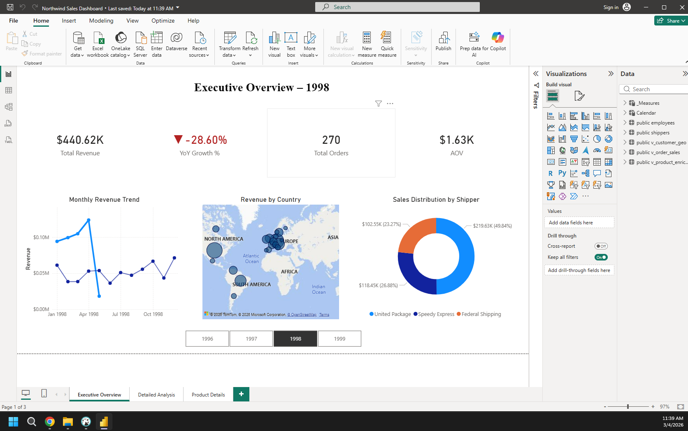
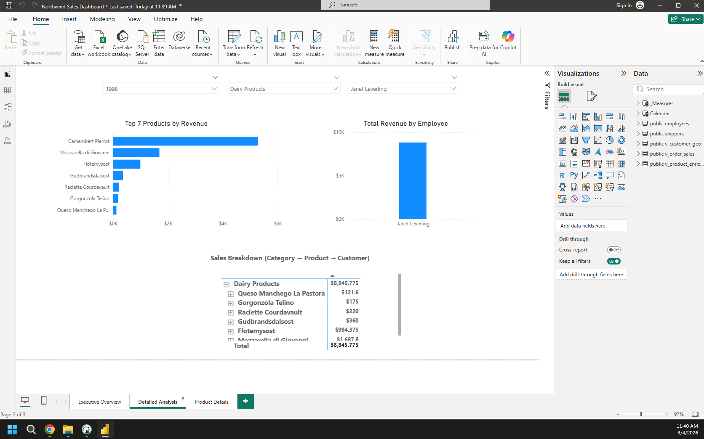
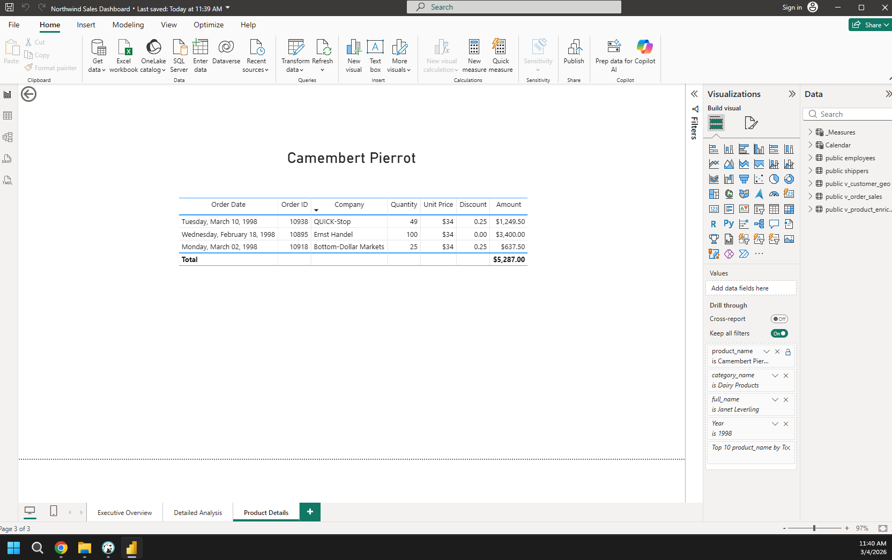

# Northwind Sales Dashboard

## Project Overview

This project presents a **Sales Analytics Dashboard** built with Power BI using the classic **Northwind dataset**.

The goal of the project is to analyze company sales performance, identify key trends, and provide insights through interactive data visualizations.

The data model is based on a **star schema**, combining sales facts with several dimension tables such as products, customers, employees, and shippers.

---

## Technologies Used

* SQL
* Power BI
* DAX
* Data Modeling
* Data Visualization

---

## Data Model

The dataset is modeled using a **star schema** approach.

Fact table:

* `v_order_sales`

Dimension tables:

* `v_product_enriched`
* `v_customer_geo`
* `employees`
* `shippers`
* `calendar`

The model enables efficient aggregation and filtering across different dimensions such as **time, geography, products, and employees**.

---

## Dashboard Pages

### 1. Executive Overview

Provides a high-level summary of company performance.

Key metrics:

* Total Revenue
* Year-over-Year Growth
* Total Orders
* Average Order Value (AOV)

Visualizations include:

* Monthly revenue trend
* Revenue by country map
* Sales distribution by shipper

---

### 2. Detailed Analysis

Allows deeper exploration of sales performance.

Features:

* Top products by revenue
* Revenue generated by employees
* Hierarchical sales breakdown (Category → Product → Customer)

Interactive filters allow analysis by:

* Year
* Product category
* Employee

---

### 3. Product Details

A drill-through page for exploring detailed product sales.

Shows:

* Order date
* Customer company
* Quantity sold
* Unit price
* Discounts
* Total amount per order

This page enables detailed inspection of individual product performance.

---

## Example Dashboard

### Executive Overview

### Detailed Analysis

### Product Details

---

## Key Features

* Interactive filtering
* Drill-through analysis
* Hierarchical sales exploration
* Dynamic measures using DAX
* Time-based analysis using a calendar table

---

## Project Purpose

This project demonstrates practical skills in:

* Data modeling
* Business intelligence reporting
* Analytical dashboard design
* Power BI development

---

## Author

GitHub: https://github.com/fetata

